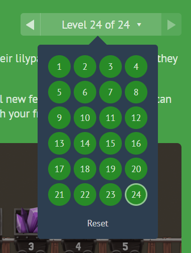

- **Captura de los 24 niveles superados**



- **Respuesta de cada nivel**

1. 

```css
justify-content: flex-end;
```

2. 

```css
justify-content: center;
```

3. 

```css
justify-content: space-around;
```

4. 

```css
justify-content: space-between;
```

5. 

```css
align-items: flex-end;
```

6. 

```css
justify-content: center;
align-items: center;
```

7. 

```css
justify-content: space-around;
align-items: flex-end;
```

8. 

```css
flex-direction: row-reverse;
```

9. 

```css
flex-direction: column;
```

10. 

```css
flex-direction: row-reverse;
justify-content: flex-end;
```

11. 

```css
flex-direction: column;
justify-content: flex-end;
```

12. 

```css
flex-direction: column-reverse;
justify-content: space-between;
```

13. 

```css
flex-direction: row-reverse;
justify-content: center;
align-items: flex-end;
```

14. 

```css
order: 1;
```

15. 

```css
order: -1;
```

16. 

```css
align-self: flex-end;
```

17. 

```css
order: 1;
align-self: flex-end;
```

18. 

```css
flex-wrap: wrap;
```

19. 

```css
flex-direction: column;
flex-wrap: wrap;
```

20. 

```css
flex-flow: column wrap;
```

21. 

```css
align-content: flex-start;
```

22. 

```css
align-content: flex-end;
```

23. 

```css
flex-direction: column-reverse;
align-content: center;
```

24. 

```css
flex-flow: column-reverse wrap-reverse;
justify-content: center;
align-content: space-between;
```
